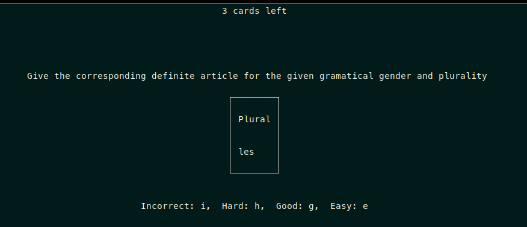

# Sparep: Declarative Spaced Repetition


## Usage

1. Declare decks of cards:

``` yaml
$ cat /home/user/decks/french-definite-articles.yaml
name: French definite articles
instructions: "Give the corresponding definite article for the given gramatical gender and plurality"
cards:
- front: Masculine singular
  back: le
- front: Feminine singular
  back: la
- front: Plural
  back: les
```

See the `examples` directory for more examples.

2. Point the config file to your cards:

```
$ cat .config/sparep/config.yaml
decks:
- /home/user/decks/french-definite-articles.yaml
# or
- /home/user/decks
```

3. Study daily

```
$ sparep
```



Sparep takes care of showing you the right cards to study at the right time.
